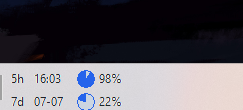
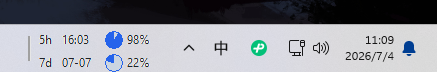

<p align="center">
  
</p>

<p align="center">
  
</p>

# Codex Usage Taskbar

一个本地 Windows 任务栏用量小组件，用于在任务栏左侧显示 Codex 和 Claude Code 的用量状态、剩余比例和重置时间。

This is a local Windows taskbar widget for showing Codex and Claude Code usage limits, remaining percentages, and reset times.

本项目基于 [CodeZeno/Claude-Code-Usage-Monitor](https://github.com/CodeZeno/Claude-Code-Usage-Monitor) 修改，保留上游 MIT License 和 attribution。

## 功能概览

- 支持 Codex 用量显示，默认启用 Codex。
- 支持 Claude Code 用量显示，可在右键菜单中启用。
- 支持 Codex + Claude Code 同时显示，也支持只显示其中一个。
- 显示 `5h` 窗口剩余比例和 5 小时重置时间。
- 显示 `7d` 窗口剩余比例和 7 天窗口日期，格式为 `MM-DD`。
- 使用紧凑的圆环时钟 UI 表示用量，减少任务栏占用空间。
- Codex 默认蓝色，Claude Code 默认橙色。
- 支持自定义 Codex 填充色、Claude 填充色、时钟底色和文字颜色。
- 支持多屏幕选择，默认放在主屏幕任务栏。
- 支持拖动调整任务栏位置，也可以通过菜单重置位置。
- 支持任务栏托盘图标、右键菜单、刷新频率、开机启动和检查更新。
- 支持简体中文和英文，默认优先使用系统语言；中文环境下显示中文。
- 支持诊断日志，日志写入本机临时目录，不上传。

## UI 显示

任务栏主界面使用两行紧凑布局：

- `5h` 行：显示 5 小时窗口、重置时间、Codex/Claude 剩余比例。
- `7d` 行：显示 7 天窗口、重置日期、Codex/Claude 剩余比例。

当 Codex 和 Claude 同时启用时，会显示两个颜色区分的圆环。  
当只启用 Codex 或只启用 Claude 时，圆环和文字会自动放大，提高可读性。

圆环按 10 个档位显示：`10%`、`20%`、...、`100%`。  
`0%` 为空环，`100%` 为满环。

## 颜色设置

右键任务栏小组件，选择 `设置 -> 颜色设置`。

颜色设置窗口支持：

- Codex 填充色
- Claude 填充色
- 时钟底色
- UI 文字颜色
- 实时预览
- 快捷色板
- 系统颜色选择器
- 应用、重置、关闭

颜色配置会保存到本机设置文件，重启后继续生效。

## 屏幕和位置

默认行为：

- 默认使用主屏幕，也就是 Windows 识别的第 1 屏。
- 启动后自动贴近任务栏左侧可用区域。
- 如果任务栏或资源管理器重启，程序会尝试自动恢复位置。

你可以：

- 在右键菜单中选择目标屏幕。
- 拖动左侧分隔线调整小组件位置。
- 使用 `重置位置` 回到默认左侧位置。

## 数据来源

Codex 用量读取顺序：

1. ChatGPT Codex usage endpoint：`https://chatgpt.com/backend-api/wham/usage`
2. 本地 fallback：读取 `%USERPROFILE%\.codex\sessions` 下最新 session JSONL 中的 `token_count.rate_limits`

远程读取会使用 Codex CLI 已登录后的本地认证文件：

```text
%USERPROFILE%\.codex\auth.json
%CODEX_HOME%\auth.json
```

access token 只用于请求用量接口，不写入日志，不提交到仓库。

本地 fallback 只解析 rate limit 元数据，不会把 prompt、对话内容或工具输出写入本项目。

## 隐私说明

- 本工具在本机运行。
- 不上传日志。
- 不提交 `.codex`、`auth.json`、session 数据或 token。
- 诊断日志默认写入：

```text
%TEMP%\codex-usage-taskbar.log
```

日志采用追加写入，便于排查重启前后的问题。

## 构建

要求：

- Windows 10 或 Windows 11
- Rust toolchain
- Visual Studio C++ Build Tools
- 已登录的 Codex CLI

构建：

```powershell
cargo test
cargo build --release
```

运行：

```powershell
.\target\release\codex-usage-taskbar.exe
```

启用诊断日志：

```powershell
.\target\release\codex-usage-taskbar.exe --diagnose
```

设置文件路径：

```text
%APPDATA%\CodexUsageTaskbar\settings.json
```

## 发布到 GitHub 前检查

发布前建议执行：

```powershell
cargo test
rg -n --hidden --glob '!target/**' "access_token|refresh_token|auth.json|OPENAI_API_KEY|sk-" .
git status --short
```

不要提交：

- `target/`
- `.env`
- `auth.json`
- `.codex/`
- `sessions/`
- 日志文件
- 本机缓存
- 任何 token 或账号凭据

## English Summary

Codex Usage Taskbar is a local Windows taskbar widget for monitoring Codex and Claude Code usage limits.

Features:

- Codex-first usage display.
- Optional Claude Code display.
- Compact two-line taskbar UI for `5h` and `7d` windows.
- `5h` reset time and `7d` reset date.
- Clock-style usage rings with 10-step fill levels.
- Custom colors for Codex, Claude, clock base, and text.
- Multi-monitor selection.
- Draggable taskbar position and reset position action.
- Simplified Chinese and English UI.
- Local diagnostic logs.

The app reads Codex usage from the ChatGPT usage endpoint first, then falls back to local Codex session JSONL rate-limit metadata. Tokens are read from the local Codex CLI auth file only for requests and are not logged.

## Upstream Attribution

Based on `CodeZeno/Claude-Code-Usage-Monitor` v1.4.8 by Code Zeno Pty Ltd.

Major changes in this fork:

- Codex is the default model.
- Claude Code is optional.
- Taskbar UI shows remaining usage instead of only used usage.
- Progress bars were replaced with compact clock-style rings.
- Added Simplified Chinese UI.
- Added custom color settings.
- Added monitor selection and better default placement on the primary screen.
- Added local Codex JSONL fallback.
- Added native color settings and about dialogs.
